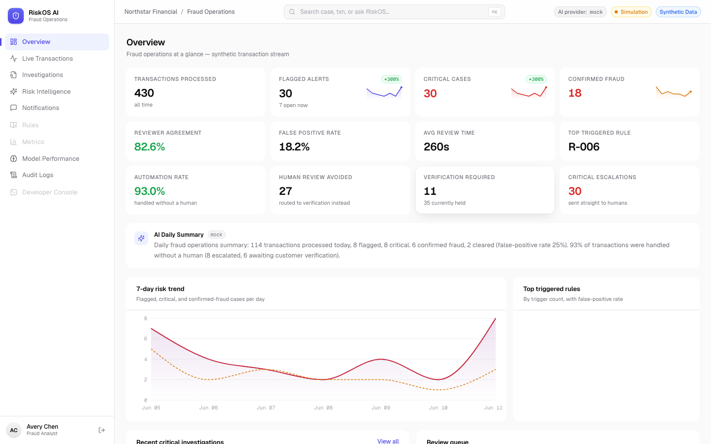
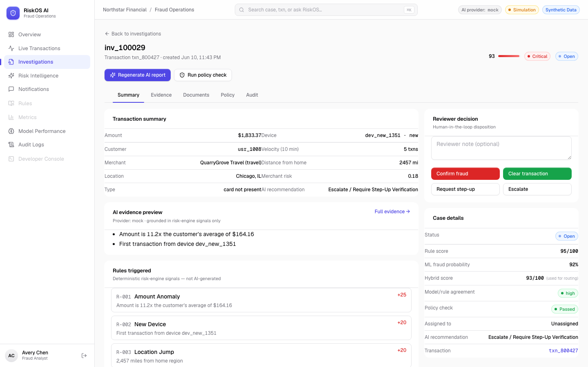
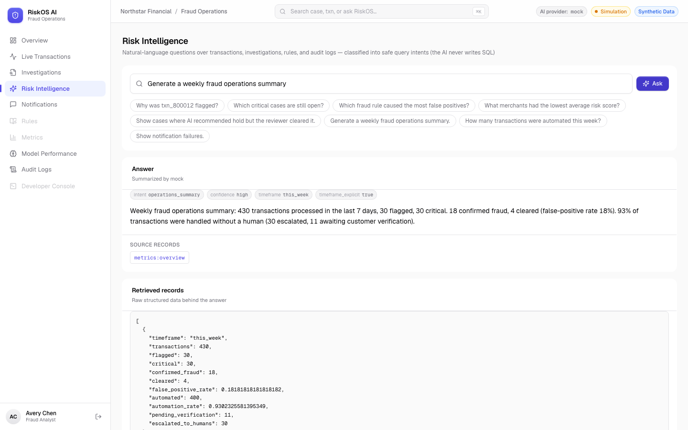
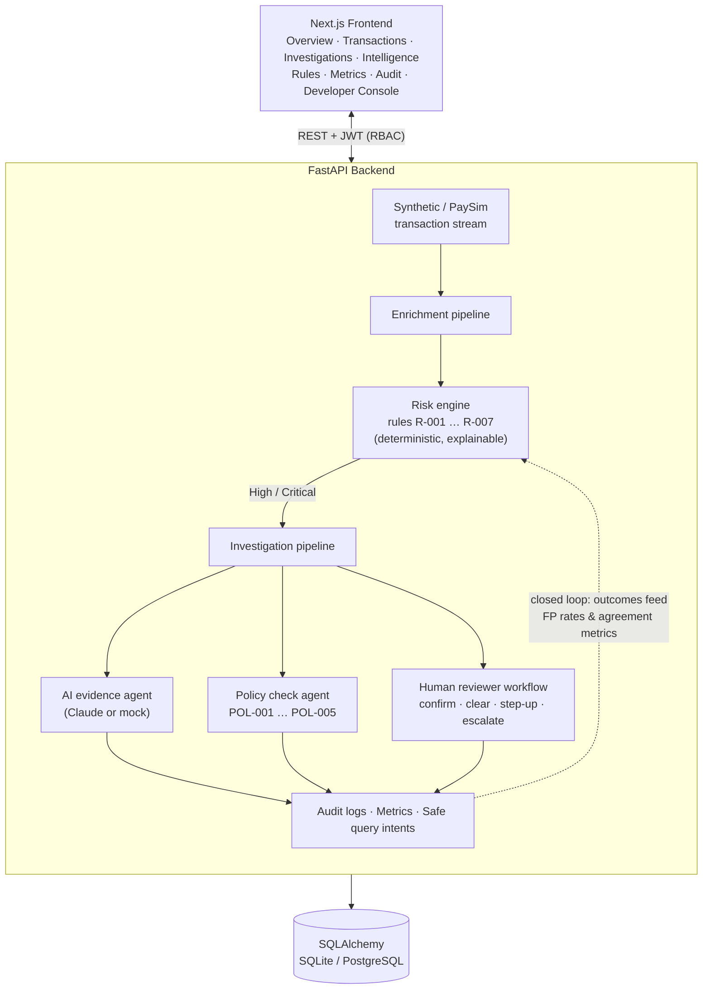

# RiskOS AI — Fraud Operations Console

> An AI-native fraud investigation console for bank risk teams, built for the fictional **Northstar Financial**.


| Overview | Investigation | Risk Intelligence |
|---|---|---|
|  |  |  |

**One-liner:** RiskOS AI simulates real-time bank transaction monitoring, scores risk with an explainable rule engine, turns flagged transactions into investigation cases, generates audit-ready AI evidence packets, checks policy compliance, captures human reviewer decisions, and makes the entire fraud operation queryable through a closed-loop dashboard.

> **RiskOS AI is a simulation project using synthetic data. It does not use real bank customer records and is not intended for production financial decisioning.**

---

## Why this project exists

Fraud operations teams at banks spend most of their time on repetitive analyst work: gathering evidence, summarizing risk signals, writing audit notes, and reconciling AI recommendations with human judgment. RiskOS AI demonstrates how an AI layer can automate that work **without** letting the AI make the actual fraud decision — the score comes from a deterministic, explainable rule engine; the human reviewer has the final say; and every step lands in an immutable audit log.

It's built to feel like a real internal fintech tool (Stripe-dashboard-style UI), not a chatbot demo.

## Key features

- **Live transaction stream** — simulated transactions enter every few seconds, each scored on arrival with risk level, status, and triggered rules
- **Explainable risk engine** — 7 deterministic fraud rules (amount anomaly, new device, location jump, velocity, merchant risk, card-not-present, dataset signal) with weighted scoring, clamped to 100, banded into Low/Medium/High/Critical
- **Hybrid ML + rule scoring** — optional ML fraud model (Logistic Regression / Random Forest on PaySim-shaped data) blended with the rule score (`0.6 × ML + 0.4 × rules`); rules stay visible as the explainability layer, with a Model Performance page (precision/recall/F1/ROC-AUC, confusion matrix, live model/rule agreement)
- **Automated Response Orchestrator** — selective human-in-the-loop: Low approves, Medium monitors, Elevated/High route to customer verification, only Critical opens a human investigation (~94% automation rate on seeded data)
- **Notification infrastructure** — templated SMS verification events via Twilio (disabled by default; masked phone numbers; only ever sends to a configured demo phone)
- **Investigation workflow** — Critical transactions become cases with Summary / Evidence / Documents / Policy / Audit tabs
- **AI evidence packets** — risk summary, evidence bullets, rules explanation, comparable pattern, customer impact note, reviewer checklist, and an audit-ready note — grounded strictly in structured signals
- **Policy / compliance agent** — five internal policies (POL-001…POL-005) checked deterministically, including grounded-explanation and protected-attribute checks
- **Human-in-the-loop review** — Confirm Fraud / Clear / Step-Up / Escalate, with AI-agreement calculation, override permissions, and outcome tracking (true/false positive)
- **Closed-loop metrics** — false-positive rate by rule, reviewer agreement, AI recommendation accuracy, review time, daily trends
- **Risk Intelligence** — a safe natural-language query layer, not an unrestricted chatbot: questions are classified into **safe parameterized intents** (timeframe, direction, risk tier, limit, IDs), deterministic backend code runs the actual queries, and the AI only summarizes retrieved records. It never writes SQL, never performs destructive actions, refuses unsafe requests (deletes, bulk approvals, secrets, outbound messaging) with safe alternatives, and never answers beyond retrieved evidence
- **Audit logs** — every login, score, AI report, policy check, decision, query, and test scenario is logged with metadata; analysts get a limited view, managers see everything
- **Developer console** — AI-generated edge-case test scenarios per rule, replayed against the risk engine with pass/fail results, plus an ad-hoc payload runner
- **RBAC** — Fraud Analyst, Risk Manager, Developer, and Admin roles with distinct permission sets enforced on both API and UI

## Architecture



The closed loop: reviewer decisions update outcomes (`true_positive` / `false_positive`), which feed rule false-positive rates, reviewer agreement, and AI-accuracy metrics — which are themselves queryable through Risk Intelligence.

## Tech stack

| Layer | Tech |
|---|---|
| Frontend | Next.js 14 (App Router), TypeScript, Tailwind CSS, shadcn-style components (hand-written), lucide-react, Recharts |
| Backend | FastAPI, Python 3.11+, SQLAlchemy 2, Pydantic 2 |
| Database | SQLite by default (zero setup) — Postgres-ready via `DATABASE_URL` |
| Auth | JWT (PyJWT) + PBKDF2 password hashing, role-based access control |
| AI | Anthropic Claude API for evidence packets, intelligence summaries, and test scenarios — with a deterministic mock provider so the full demo runs **offline with no API key** |

## Data source

RiskOS AI uses the PaySim synthetic financial fraud dataset, which models real-world mobile money transaction behavior, then enriches it with simulated merchant profiles, device fingerprints, locations, velocity signals, fraud rules, reviewer decisions, and audit logs to create a bank-risk investigation workflow.

By default the seed script generates PaySim-shaped synthetic data directly (no download required). To seed from a real PaySim CSV instead: `python -m scripts.seed --paysim path/to/paysim.csv`.

## AI safety / design

The AI layer is intentionally constrained:

- **AI never makes the fraud decision.** The score comes from the deterministic rule engine; the disposition comes from a human reviewer.
- **AI never invents facts.** Prompts pass only structured fields (amount, velocity, device, distance, merchant risk, triggered rules); the policy agent flags explanations that reference signals not present in the record (POL-002).
- **No protected attributes.** They are never stored, scored, or referenced (POL-005).
- **No free-form SQL.** Risk Intelligence classifies questions into safe predefined query intents; retrieval is hand-written and parameterized; the LLM only summarizes retrieved records.
- **Everything is audited.** AI report generation, policy checks, queries, and overrides are all logged with actor, role, and metadata.

## How the risk engine works

Each transaction is scored against active rules:

| Rule | Signal | Points |
|---|---|---|
| R-001 Amount Anomaly | amount > 5× user average | +25 |
| R-002 New Device | unrecognized device fingerprint | +20 |
| R-003 Location Jump | > 500 miles from home region | +20 |
| R-004 Transaction Velocity | ≥ 4 txns in 10 minutes | +20 |
| R-005 Merchant Risk | merchant risk score > 0.7 | +15 |
| R-006 Card-Not-Present | CNP transaction type | +10 |
| R-007 Dataset Signal | suspicious dataset label / balance mismatch | +20 |

Score is clamped to 100 and banded: **0–39 Low** (approve) · **40–69 Medium** (monitor) · **70–84 High** (hold for review) · **85–100 Critical** (escalate / step-up). The Automated Response Orchestrator (see below) decides what happens next — only Critical transactions automatically open human investigations. Rules can be enabled/disabled live from the Rules page (Risk Manager/Admin).

## Selective human-in-the-loop automation

RiskOS does **not** require human review for every flagged transaction. An
**Automated Response Orchestrator** ([backend/app/response_orchestrator.py](backend/app/response_orchestrator.py))
sits between the risk engine and the investigation workflow and routes each
scored transaction so humans only see the cases that genuinely need them:

| Score | Response tier | Automated response | Human involved? |
|---|---|---|---|
| 0–39 | Low | Approve automatically | No |
| 40–59 | Medium | Approve + monitor | No |
| 60–74 | Elevated | Require customer verification | No |
| 75–84 | High | Hold transaction + require customer verification | No |
| 85–100 | Critical | Hold transaction + escalate to human review immediately | Yes — investigation opened |

Every routing decision is audit-logged (`transaction_auto_approved`,
`transaction_monitored`, `verification_required`,
`transaction_held_for_verification`, `critical_escalation`), and the Overview
page tracks the automation rate, human reviews avoided, pending verifications,
and critical escalations. The risk *score* itself still comes exclusively from
the deterministic rule engine — the orchestrator only decides what happens next.

## Hybrid ML + Rule-Based Scoring

RiskOS layers an **optional ML fraud model** on top of the deterministic rule
engine — without ever removing it:

- **Rules provide explainability and auditability.** Every triggered rule, its
  weight, and its detail string stay visible on every transaction and in every
  audit record. Regulators and reviewers can always answer *"why was this flagged?"*
- **ML provides learned pattern detection.** A model trained on PaySim-shaped
  transaction data (`python -m scripts.train_model`, Logistic Regression vs
  Random Forest, best ROC-AUC wins) outputs a fraud probability per transaction.
- **The hybrid score combines both:** `hybrid = 0.6 × ML(0–100) + 0.4 × rule score`.
  The Automated Response Orchestrator routes on the hybrid score when a model
  is available and falls back to the rule score when it isn't — the app works
  fully without a model artifact.
- A **model/rule agreement** label (high / medium / low) surfaces when the two
  layers disagree — disagreement is signal, not noise.

**On metrics:** accuracy alone is misleading for fraud — with ~12% fraud, always
predicting "legitimate" is ~88% accurate and worthless. The Model Performance
page reports precision, recall, F1, ROC-AUC, and the confusion matrix, and the
ops dashboard tracks per-rule false-positive rates. The ML model is never the
final authority: Critical cases always escalate to human review, and this
remains a simulation — not production financial decisioning.

```bash
cd backend
pip install -r requirements-dev.txt      # includes scikit-learn
python -m scripts.train_model            # writes app/model_artifacts/fraud_model.pkl
python -m scripts.seed --reset           # rescore the demo stream with hybrid scoring
```

## Evidence Intake & Cross-Check

Fraud teams receive photos of receipts, tickets, bank letters, police reports,
and handwritten dispute letters. RiskOS turns them into machine-verified case
evidence:

1. **Capture** — photograph or upload a document on the investigation's
   *Documents* tab (mobile camera supported).
2. **Extract** — Claude's vision API reads the document (handwriting included)
   into structured fields. By design the model **never sees the transaction**,
   so it cannot bias its reading toward agreement.
3. **Cross-check** — deterministic code (not the LLM) reconciles the extracted
   amount, date, merchant, and location against the transaction record and
   issues a verdict: `consistent · partially_consistent · inconsistent ·
   unverifiable`, with field-by-field results, tampering signals, and a
   confidence score.
4. **Audit** — extraction, verdict, and uploader are attached to the case and
   audit-logged (`evidence_document_uploaded`, `evidence_document_analyzed`).

Without an `ANTHROPIC_API_KEY`, a deterministic mock provider keeps the full
flow demoable offline (clearly labeled — the mock does not read the image).

## Outbound SMS verification (Phase 2)

When the orchestrator routes a transaction to `verification_required` or
`held_for_verification`, RiskOS records a **notification event** and — if
Twilio is configured — sends a real SMS:

> *"Northstar Financial: Did you attempt a $1,234.56 transaction at SummitMart Pay in Austin, TX? Reply YES or NO."*

Messages are **strict templates only** (never LLM-generated). To enable real
sending, set in `backend/.env`:

```bash
SMS_ENABLED=true
TWILIO_ACCOUNT_SID=ACxxxxxxxx
TWILIO_AUTH_TOKEN=xxxxxxxx
TWILIO_FROM_NUMBER=+15550000001
DEMO_CUSTOMER_PHONE=+1XXXXXXXXXX   # your own phone
```

**Safety:** this is a simulation — when enabled, SMS goes **only** to
`DEMO_CUSTOMER_PHONE`, never to generated customer numbers. Without Twilio
config, events are recorded as `queued` and the pipeline continues normally.

> **Twilio trial limitation:** trial accounts cannot send free-form SMS bodies
> (Twilio rejects them with error `572006: Trial accounts can only use
> predefined SMS templates`). RiskOS captures the failure cleanly (event marked
> `failed`, error code audit-logged) — but to actually receive the verification
> texts you must **upgrade the Twilio account** (add a balance). Keep
> `SMS_ENABLED=false` (the default) until then; the full notification flow
> still demos offline with `queued` events.
Only masked numbers (`***-***-1234`) are stored or returned by the API, and
every queued/sent/failed delivery is audit-logged. Admin/Developer roles can
re-send a verification SMS from the transaction drawer; everything is listed
on the Notifications page. Inbound YES/NO replies and a voice-call fallback
are planned for later phases.

## How the closed loop works

1. Transaction scored → orchestrator routes it (approve / monitor / verify / hold / escalate) → Critical cases open an investigation (audit logged)
2. AI generates an evidence packet from structured signals
3. Policy agent verifies compliance (review threshold, grounded explanation, step-up requirement, audit completeness, protected attributes)
4. Reviewer decides: confirm fraud / clear / step-up / escalate
5. System computes outcome (true/false positive) and whether the AI agreed
6. Metrics update: FP rate per rule, reviewer agreement, AI accuracy, review time
7. All of it becomes queryable: *"Which rule caused the most false positives?"*

## Run locally

**Backend** (Python 3.11+):

```bash
cd backend
pip install -r requirements.txt
cp .env.example .env            # optional — defaults work out of the box
python -m scripts.seed          # seeds users, rules, 7 days of transactions
uvicorn app.main:app --reload   # http://localhost:8000 (docs at /docs)
```

**Frontend** (Node 18+):

```bash
cd frontend
npm install
cp .env.local.example .env.local
npm run dev                     # http://localhost:3000
```

### Environment variables

See [backend/.env.example](backend/.env.example) for the full annotated list.

| Variable | Default | Purpose |
|---|---|---|
| `DATABASE_URL` | `sqlite:///./riskos.db` | Swap to `postgresql+psycopg2://…` for Postgres |
| `JWT_SECRET` | dev default | Token signing secret |
| `ANTHROPIC_API_KEY` | *(unset)* | If set, AI features use Claude; otherwise a deterministic mock provider keeps the full demo working offline |
| `MOCK_AI` | *(unset)* | Set `true` to force the mock provider even with an API key (used in tests/CI). The active provider is shown in the UI header |
| `CORS_ORIGINS` | localhost 3000/3001 | Comma-separated allowed frontend origins; add your deployed origin here |
| `NEXT_PUBLIC_API_URL` | `http://localhost:8000` | Frontend → backend URL |

## Tests & CI

The backend has a **189-test pytest suite** (`backend/tests/`) covering the risk
engine rule by rule, risk-band and orchestrator-tier boundaries, RBAC enforcement
(analyst override → 403, manager override → 200), policy-check determinism, the
closed metrics loop, hybrid ML scoring (fallback, boundaries, agreement labels),
the Automated Response Orchestrator routing matrix, notification safety (Twilio
fully mocked — demo-phone-only guard, no-crash without credentials), Risk
Intelligence (intent routing, parameter extraction, timeframes, sort-direction
correctness, unsafe-request blocking), evidence cross-check logic, and API
guardrails (input limits, pagination, auth edge cases). Twilio and the Claude
API are always mocked in tests — no external calls.

```bash
cd backend
pip install -r requirements-dev.txt
python -m pytest tests/ -v
```

GitHub Actions ([.github/workflows/ci.yml](.github/workflows/ci.yml)) runs the backend
test suite and a production `next build` on every push and pull request.

### Demo users (password: `demo1234`)

| Role | Email | Can |
|---|---|---|
| Fraud Analyst | `analyst@northstar.demo` | View stream/cases, submit reviewer decisions, limited audit view |
| Risk Manager | `manager@northstar.demo` | Everything analysts can + metrics, rules, full audit, decision override |
| Developer | `developer@northstar.demo` | Developer console, scenario generation, rule tests |
| Admin | `admin@northstar.demo` | Everything |

## API overview

```
POST /auth/login · GET /auth/me · GET /auth/demo-users
GET  /transactions · GET /transactions/{id} · POST /transactions/generate-batch
GET  /investigations · GET /investigations/{id}
POST /investigations/{id}/generate-ai-report
POST /investigations/{id}/policy-check
POST /investigations/{id}/review
GET  /rules · PATCH /rules/{id}
GET  /metrics/overview · /metrics/rules · /metrics/charts · /metrics/daily-summary
GET  /audit-logs · GET /audit-logs/{id}
GET  /notifications · GET /notifications/{id}
POST /notifications/send-verification/{txn_id}   (Admin/Developer)
GET  /health                       (env + active AI provider)
POST /risk-intelligence/query · GET /risk-intelligence/suggestions
POST /developer/generate-scenario · POST /developer/run-scenario
GET  /developer/sample-payloads · GET /developer/scenario-history
```

List endpoints (`/transactions`, `/investigations`, `/audit-logs`) support `limit` and `offset` pagination. Interactive docs: `http://localhost:8000/docs`.

## Future improvements

- WebSocket transaction stream (currently polling)
- ML-based anomaly score as an additional rule input (still explainable, still human-reviewed)
- Case assignment / queue routing between analysts
- Policy regression suite in the developer console
- Dockerized one-command setup

## Resume bullets

- Built RiskOS AI, a real-time AI fraud investigation platform using FastAPI, PostgreSQL, Next.js, and LLM workflows to analyze synthetic transaction streams, generate evidence packets, and automate audit logging.
- Designed a closed-loop reviewer workflow where AI fraud recommendations are accepted/rejected by human analysts, updating false-positive metrics, reviewer agreement rate, and investigation outcomes.
- Implemented role-based access control for fraud analysts, risk managers, and developers across transaction review, audit logs, and rule-testing workflows.
- Developed a queryable risk intelligence layer allowing natural language search across transactions, fraud alerts, AI explanations, policy checks, reviewer decisions, and audit logs.
- Created a rule-based fraud scoring engine with AI-generated investigation summaries for velocity, location anomaly, new-device, merchant-risk, and amount-anomaly scenarios.

---

*Northstar Financial is a fictional demo organization. RiskOS AI is a simulation project using synthetic data. It does not use real bank customer records and is not intended for production financial decisioning.*
